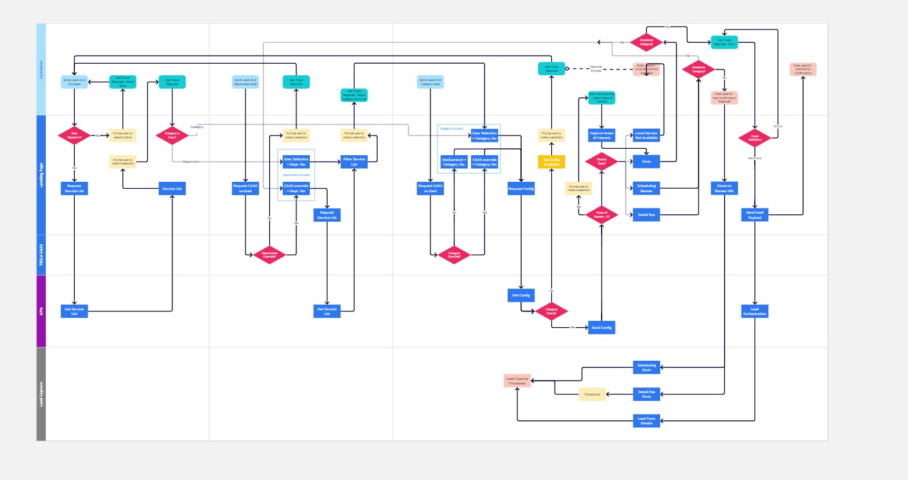
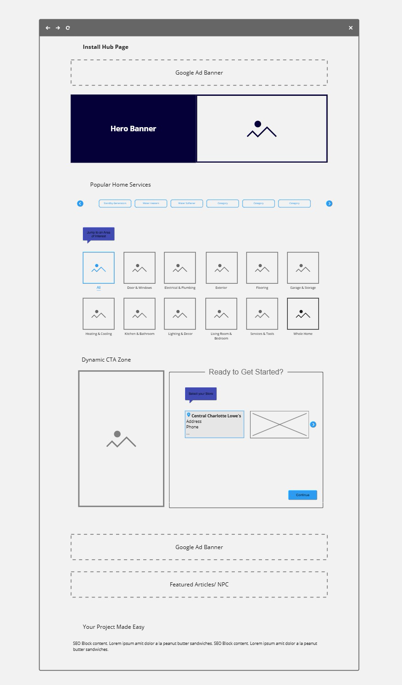
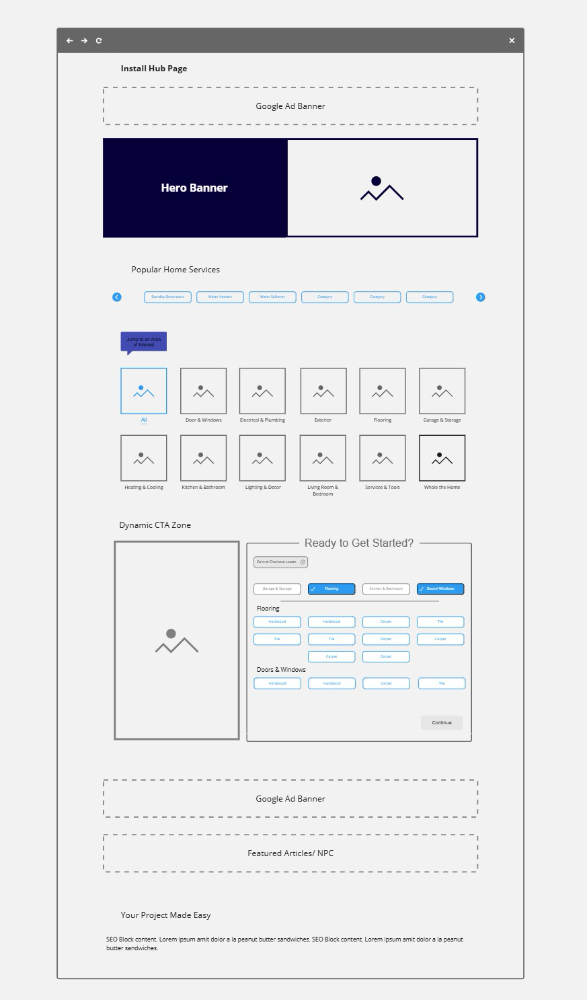
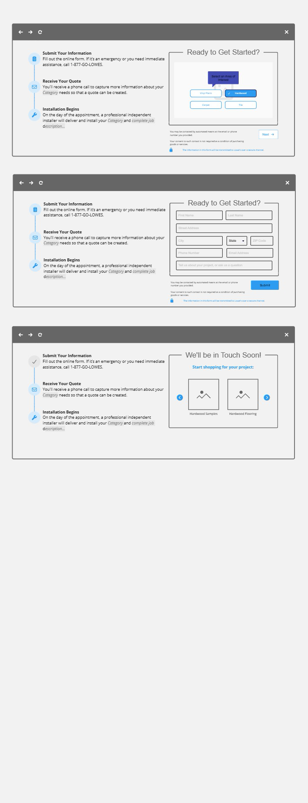
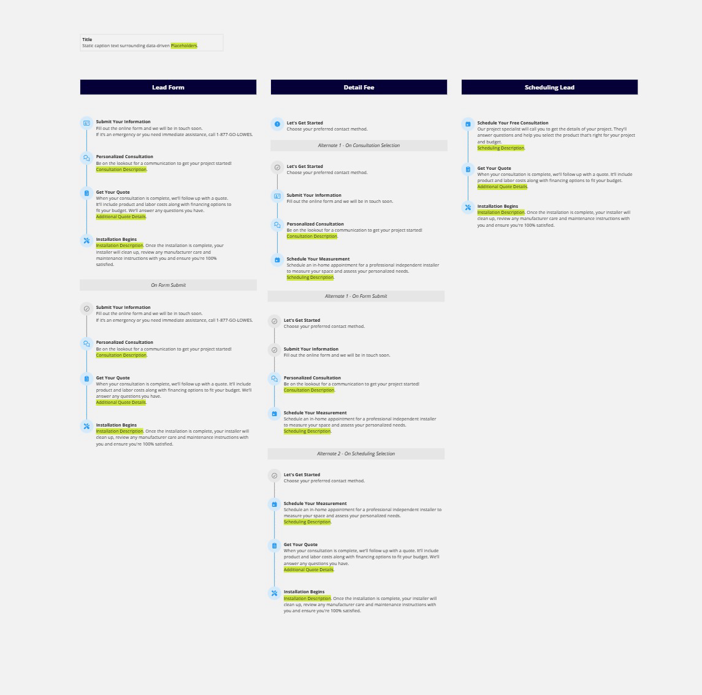
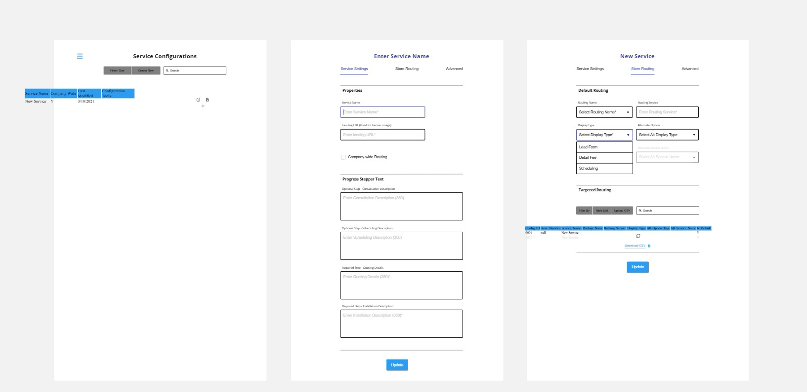
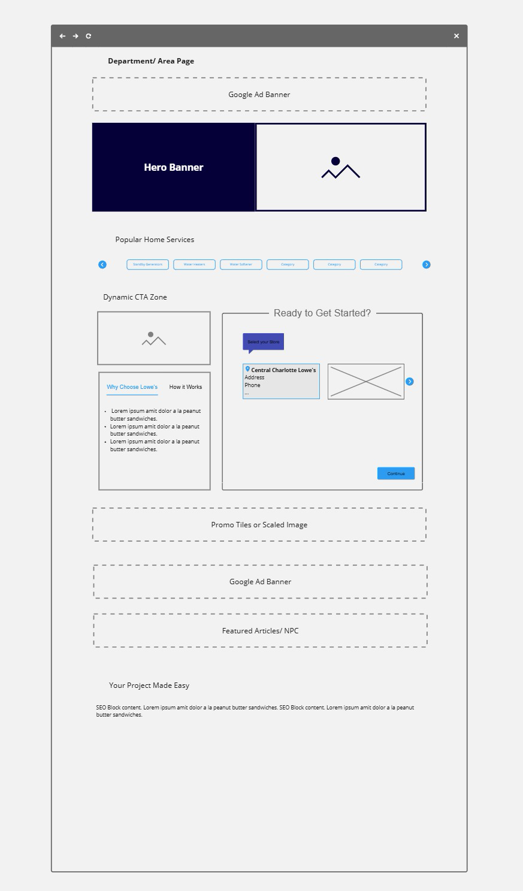
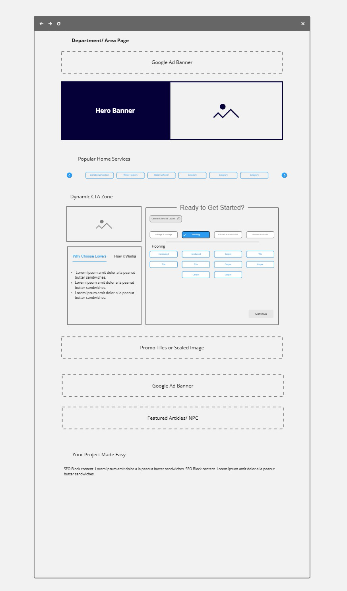
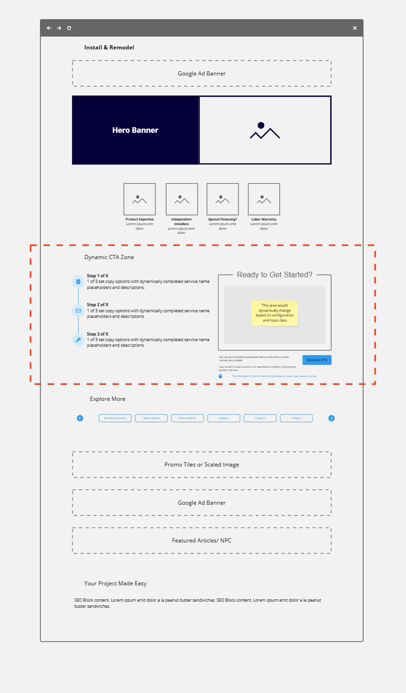

# PRD: Installation Services Lead Capture Widget
### E-Commerce Web Platform — Consolidated Installation Services Experience

---

## Overview

This repository contains the product requirements, system design, and API specification for a configurable, stepped-form widget designed to replace 40+ individually maintained installation service forms across 7 categories on a large home improvement retailer's e-commerce platform. The widget was designed to guide customers through service selection, adapt its data collection experience based on service type, and consolidate all leads into a single Microsoft Dynamics CRM endpoint — replacing a fragmented landscape of inconsistently routed, untracked forms with a single maintainable, measurable experience.

This initiative reached full UX prototype and user testing completion and was in active elaboration with development before being deprioritized in favor of the platform migration.

📄 **[Read the full PRD →](./prd-installation-services-widget.md)**
🏛️ **[Read the System Design →](./system-design-caas-installation-services.md)**
🔌 **[Read the API Spec →](./api-spec-caas-installation-services.md)**

---

## What This Demonstrates

**Problem framing from operational data** — The fragmentation wasn't just a UX problem — it was an operational liability. Inconsistent CRM routing caused leads to go undelivered. Missing submission confirmations left customers at dead ends. Zero step-level analytics meant there was no visibility into where customers dropped off or why. The PRD frames the widget as a fix to all three simultaneously, not just a form redesign.

**Service type architecture** — Three distinct service types (Measurement Required, Third-Party Contractor, Simple Install) drive meaningfully different data collection requirements and fulfillment paths. Rather than building three separate forms, the PRD defines a single adaptive flow that determines service type via API and renders the appropriate experience — keeping the customer journey consistent while accommodating real operational variation.

**Dual-mode component design** — The widget was designed to operate as both a standalone end-to-end experience and as a configurable component embeddable on category and landing pages — scoped to a specific service or category. This reflects a deliberate strategy to bring lead capture closer to where customers were already browsing rather than requiring navigation to a separate page.

**Discovery-to-deprioritization transparency** — This PRD documents an initiative that was validated but never shipped. UX prototypes were completed, user testing was conducted, and development elaboration was underway when the initiative was deprioritized following the acceleration of the platform migration. Section 13 documents this honestly — including what was completed, what wasn't, and why. Showing how a PM handles a deprioritized initiative with validated work is as meaningful as a shipped feature.

**Consolidated lead management** — The PRD scopes Microsoft Dynamics as the single lead endpoint across all service types — replacing a legacy system split across Salesforce and email routing — and defines field mapping, service type attribution, and retry logic for failed submissions.

**Self-service configuration** — The CAAS Config Dashboard gives the Installation Services business unit direct ownership of service configurations without engineering involvement. The system design and API spec define the full architecture that makes this possible.

---

## Wireframes

The following wireframes were produced during discovery and reached full UX prototype stage before the initiative was deprioritized. All screens reflect the validated design at the point of deprioritization.

### Lead UI Flow
Full decision tree across Customer, CAAS, Landing Page, API, and Lead Capture swim lanes — including override logic, service type determination, and terminal states.

---

### Hub Page — Widget States
The widget in context on the installation services hub page. Left: zipped-out (collapsed) state. Right: zipped-in (expanded) state with category grid and service navigation visible.

---

### Lead Form — Areas of Interest & Confirmation
Multi-step form progression including Areas of Interest selection, contact information collection, and post-submission confirmation with product carousel. Includes mobile variant.

---

### Progress Stepper — All Three Display Types
Side-by-side comparison of the three display types: Lead Form, Detail Fee, and Scheduling Lead — each with their respective step progressions and alternate flow states.

---

### Service Configurations Dashboard
The CAAS Config GUI — internal admin tool for managing service configurations. Shows the list view with search/filter/create, and the edit panel with all four description fields (consultation, scheduling, quoting, installation).

---

### Department Page — Widget States
Widget embedded on a department landing page, pre-scoped to a category. Left: zipped-out. Right: zipped-in with subcategory selection active.

---

### Service-Driven CTA Zone
The widget embedded in a service-driven CTA zone on a landing page — the embedded mode placement context where the widget is pre-scoped to a specific service.

---

## Document Metadata

| | |
|---|---|
| **Product** | E-Commerce Web Platform — Installation Services |
| **Document Type** | PRD · System Design · API Spec |
| **Status** | Discovery Complete · Deprioritized (platform migration) |
| **Date** | 2020–2021 |
| **Surface** | Desktop web · Mobile web |
| **Platform** | In-house headless CMS · React · Google Cloud |

---

## Related Artifacts

**In this repository:**

| Artifact | Description |
|---|---|
| [PRD: Installation Services Lead Capture Widget](./prd-installation-services-widget.md) | Full product requirements — widget flow, service types, display types, CRM integration, CAAS config |
| [System Design: CAAS Architecture](./system-design-caas-installation-services.md) | Component architecture, state machine, data flow, Dynamics integration, config dashboard, analytics |
| [API Spec: CAAS Lead Capture](./api-spec-caas-installation-services.md) | Full API contracts for config retrieval, lead submission, and service management |

**Related portfolio artifacts:**

| Artifact | Description |
|---|---|
| [PRD: E-Commerce CMS Platform Migration](https://github.com/thedmons/prd-ecommerce-cms-migration) | Platform migration that caused this initiative to be deprioritized — AEM to in-house headless CMS on Google Cloud |
| [PRD: Email & SMS Signup Toast](https://github.com/thedmons/prd-email-sms-signup-toast) | Related feature PRD from the same platform — first-visit subscriber acquisition with DIY/Pro segmentation |
